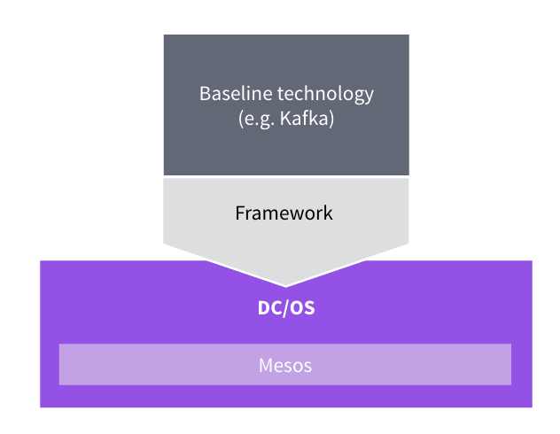
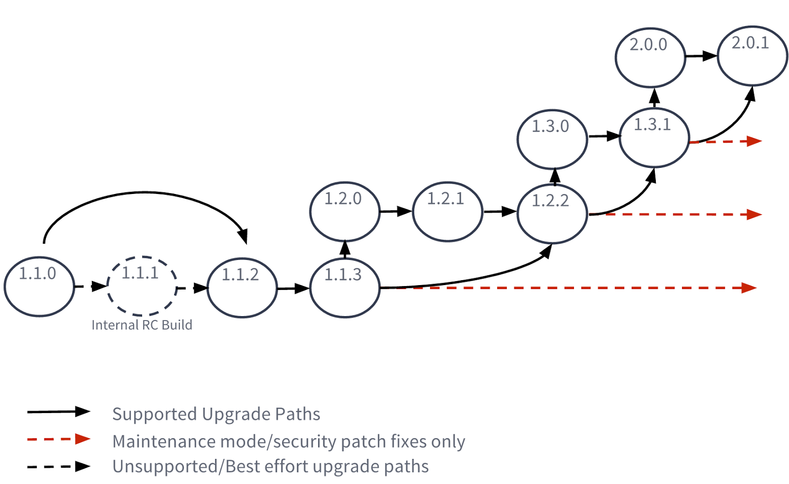

The format of Mesosphere DC/OS version number is: `<Release>.<Version>.<Minor>`.

### Release
Modifications or enhancements to the same software product as designated by a change in the `R` release number.  An `R` release may include new changes and breaking changes. `R` Releases do not include separate or different products marketed by Mesosphere under a different name even if such products are compatible with the relevant software product.

### Version
Modifications or enhancements to the same software product as designated by a change in the `V` release number. `V` releases will continue to provide backward compatibility to all released APIs.

### Minor
Bug fixes and new enhancements to the same software product as designated by a change in the patch release number.

For example, version 5.6.3, means `R` is 5, `V` is 6, an d`M` is 3. 

## Mesosphere Software End of Life Policy

Mesosphere will support product releases for the currently released version (Release N) and the previous 2 feature (major or minor release) releases (Releases N-1 and N-2). At the time of Release N-1, Mesosphere will announce End of Life (EOL) date of Release N-2. When Release N is generally available, Mesosphere will EOL Release N-2.

Here is a hypothetical example to help you understand which version is the supported version. 

1.  May 2020 - Product X v1.0 is released.
1.  Aug 2020 - Product X v1.1 is released, v1.0 EOL date is announced.
1.  Nov 2020 - Product X v1.2 is released,  v1.0 is EOL’d, v1.1 EOL date is announced.

## DC/OS Versions and Mesos Interoperability Matrix

All versions of DC/OS come bundled with a compatible Mesos version and its release number will be noted in the appropriate DC/OS Release Version release notes.

## DC/OS Versions and Service Scheduler Interoperability Matrix

All Mesosphere-driven Service Frameworks and their attached baseline technology will be tested to interoperate with the current DC/OS and the previous DC/OS release. Similarly, every release of DC/OS will support the current available (GA) software that the service scheduler leverages and its previous release.  If a DC/OS release supports an older version of the service scheduler, the older service scheduler may not support all of the features provided by the newer version of DC/OS.

For example, if we have 3 pieces of technology: DC/OS, Framework, and Apache Kafka.

Our interoperability guarantees in the scenario above will be as follows:

| **DC/OS Release**                                 | **Current DC/OS Release N**                                                 |
|-----------------------------------------------|-------------------------------------------------------------------------|
| Framework and Baseline Tech (eg. Apache Kafka ) | Current Framework Version (M+Apache Kafka K) and (M-1+Apache Kafka K-1) |

## Parking Lot/Future

<!-- ### Semantic Versioning

Semantic versioning is a widely-adopted scheme for describing meaning about the underlying code and what has been modified from one version to the next.  It is  well documented at [www.semver.org](http://www.semver.org/) and is based on a release number which has 3 primary components: major release number, minor release number and patch release number.

### `<MAJOR>.<MINOR>.<PATCH>`
-->

#### Major 
A major release means modifications or enhancements to the same software product as designated by a change in the major release number.  A major release may include new breaking API changes. Major Releases do not include separate or different products marketed by Mesosphere under a different name even if such products are compatible with the relevant software product.

#### Minor
A minor release means modifications or enhancements to the same software product as designated by a change in the minor release number. Minor releases will continue to provide backward compatibility to all released APIs.

#### Patch
A patch release means bug fixes and new enhancements to the same software product as designated by a change in the patch release number.

## Mesosphere Versioning and Upgrade Policy

