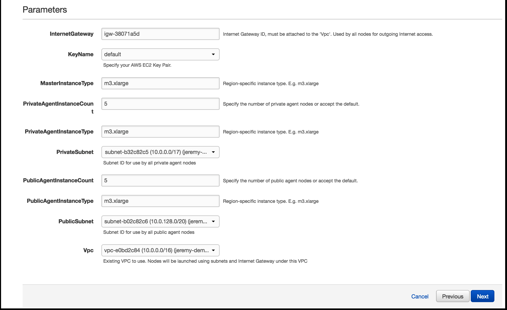
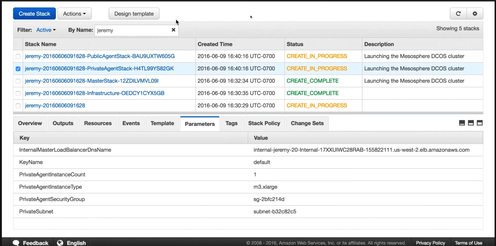
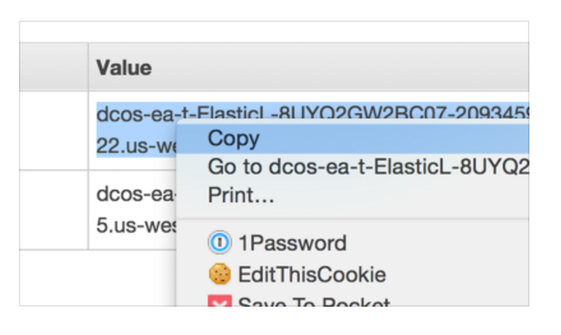
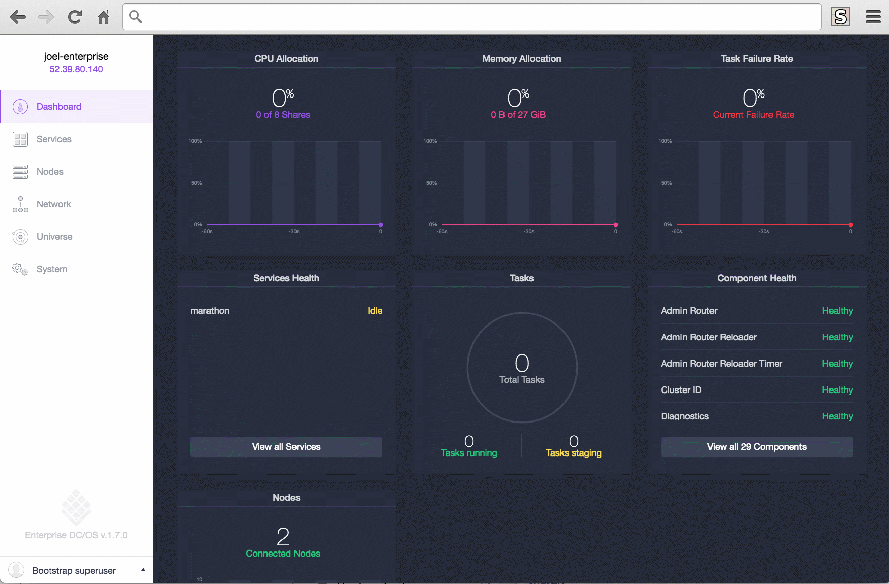
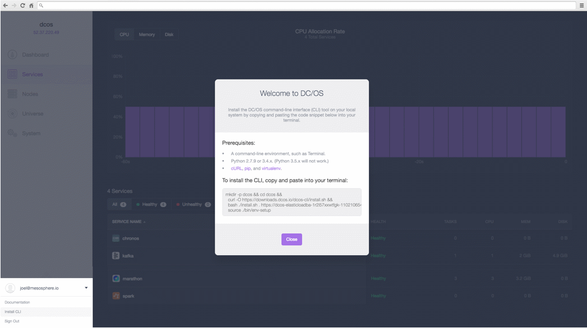

You can quickly get up and running with the advanced DC/OS templates. 

# System requirements

### Hardware

An Amazon EC2 <a href="https://aws.amazon.com/ec2/pricing/" target="_blank">m3.xlarge</a> instance. DC/OS runs multiple containers in a single VM to achieve higher utilization, therefore large instance types are generally the most economical. Selecting smaller-sized VMs is not recommended, and selecting fewer VMs will likely cause certain resource-intensive services, such as distributed datastores, to not work properly. 

### Software

- Enterprise DC/OS advanced AWS templates. Contact your sales representative or <a href="mailto:sales@mesosphere.com">sales@mesosphere.com</a> to obtain these files.
- An Amazon Web Services account with root [IAM](https://aws.amazon.com/iam/) privileges. Advanced privileges are required to install the templates. Contact your AWS admin for more information.
- AWS [Command Line Interface](https://aws.amazon.com/cli/)
- [jq](https://github.com/stedolan/jq/wiki/Installation)

# Launch your cluster

## Create your dependencies

Use the `zen.sh` script to create the template dependencies. These dependencies will be used as input to create your stack in CloudFormation.

1.  Save this script as `zen.sh`                                                                     

    ```bash
    #!/bin/bash
    export AWS_DEFAULT_OUTPUT="json"
    set -o errexit -o nounset -o pipefail
    
    if [ -z "${1:-}" ]
    then
      echo Usage: $(basename "$0") STACK_NAME
      exit 1
    fi
    
    STACK_NAME="$1"
    VPC_CIDR=10.0.0.0/16
    PRIVATE_SUBNET_CIDR=10.0.0.0/17
    PUBLIC_SUBNET_CIDR=10.0.128.0/20
    
    echo "Creating Zen Template Dependencies"
    
    vpc=$(aws ec2 create-vpc --cidr-block "$VPC_CIDR" --instance-tenancy default | jq -r .Vpc.VpcId)
    aws ec2 wait vpc-available --vpc-ids "$vpc"
    aws ec2 create-tags --resources "$vpc" --tags Key=Name,Value="$STACK_NAME"
    echo "VpcId: $vpc"
    
    ig=$(aws ec2 create-internet-gateway | jq -r .InternetGateway.InternetGatewayId)
    aws ec2 attach-internet-gateway --internet-gateway-id "$ig" --vpc-id "$vpc"
    aws ec2 create-tags --resources "$ig" --tags Key=Name,Value="$STACK_NAME"
    echo "InternetGatewayId: $ig"
    
    private_subnet=$(aws ec2 create-subnet --vpc-id "$vpc" --cidr-block "$PRIVATE_SUBNET_CIDR" | jq -r .Subnet.SubnetId)
    aws ec2 wait subnet-available --subnet-ids "$private_subnet"
    aws ec2 create-tags --resources "$private_subnet" --tags Key=Name,Value="${STACK_NAME}-private"
    echo "Private SubnetId: $private_subnet"
    
    public_subnet=$(aws ec2 create-subnet --vpc-id "$vpc" --cidr-block "$PUBLIC_SUBNET_CIDR" | jq -r .Subnet.SubnetId)
    aws ec2 wait subnet-available --subnet-ids "$public_subnet"
    aws ec2 create-tags --resources "$public_subnet" --tags Key=Name,Value="${STACK_NAME}-public"
    echo "Public SubnetId: $public_subnet"
    ```
    
1.  Run the script with a single argument, `STACK_NAME`. This argument is used to tag the AWS resources created. For example, to add the `dcos`tag:

    ```bash
    bash ./zen.sh dcos
    ```

    The output should look like this:
    
    ```bash
    Creating Zen Template Dependencies
    VpcId: vpc-e0bd2c84
    InternetGatewayID: igw-38071a5d
    Private SubnetId: subnet-b32c82c5
    Public SubnetId: subnet-b02c55c4
    ```
    
    Use these dependency values as input to create your stack in CloudFormation in the next steps. 

## Launch the DC/OS template on CloudFormation

1.  Go to [CloudFormation](https://console.aws.amazon.com/cloudformation/home) and click **Create Stack**.
1.  On the **Select Template** page, upload the [Zen](/docs/1.7/administration/installing/ent/cloud/aws/advanced/template-reference/#zen) template from your workstation and click **Next**.
1.  On the **Specify Details** page, specify these values and and click **Next**.

    

    *  **Stack name** Specify the cluster name.
    *  **InternetGateway** Specify the `InternetGatewayID` output value from the `zen.sh` script. The Internet Gateway ID must be attached to the VPC. This Internet Gateway will be used by all nodes for outgoing internet access.
    *  **KeyName** Specify your AWS EC2 Key Pair. 
    *  **MasterInstanceType** Specify the Amazon EC2 instance type. The <a href="https://aws.amazon.com/ec2/pricing/" target="_blank">m3.xlarge</a> instance type is recommended.
    *  **PrivateAgentInstanceCount** Specify the number of private agents.
    *  **PrivateAgentInstanceType** Specify the Amazon EC2 instance type for the private agent nodes. The <a href="https://aws.amazon.com/ec2/pricing/" target="_blank">m3.xlarge</a> instance type is recommended.
    *  **PrivateSubnet** Specify the `Private SubnetId` output value from the `zen.sh` script. This subnet ID will be used by all private agents. 
    *  **PublicAgentInstanceCount** Specify the number of public agents.
    *  **PublicAgentInstanceType** Specify the Amazon EC2 instance type for the public agent nodes. The <a href="https://aws.amazon.com/ec2/pricing/" target="_blank">m3.xlarge</a> instance type is recommended.
    *  **PublicSubnet** Specify the `Public SubnetId` output value from the `zen.sh` script. This subnet ID will be used by all public agents. 
    *  **Vpc** Specify the `VpcId` output value from the `zen.sh` script. All nodes will be launched by using subnets and Internet Gateway under this VPC. 
    
1.  On the **Options** page, accept the defaults and click **Next**.
    
    **Tip:** You can choose whether to rollback on failure. By default this option is set to **Yes**.
    
1.  On the **Review** page, check the acknowledgement box and then click **Create**.

    **Tip:** If the **Create New Stack** page is shown, either AWS is still processing your request or you’re looking at a different region. Navigate to the correct region and refresh the page to see your stack.
    
## Monitor the DC/OS cluster convergence process

In CloudFormation you should see:

*  The cluster stack spins up over a period of 15 to 20 minutes. You will have a stack created for each of these, where `<stack-name>` is the value you specified for **Stack name** and `<stack-id>` is an auto-generated ID.

   

   *  Zen template: `<stack-name>`
   *  Public agents: `<stack-name>-PublicAgentStack-<stack-id>`
   *  Private agents: `<stack-name>-PrivateAgentStack-<stack-id>` 
   *  Masters: `<stack-name>-MasterStack-<stack-id>`
   *  Infrastructure: `<stack-name>-Infrastructure-<stack-id>`

* The status changes from `CREATE_IN_PROGRESS` to `CREATE_COMPLETE`.

**Troubleshooting:** A `ROLLBACK_COMPLETE` status means the deployment has failed. See the **Events** tab for useful information about failures.

## Launch DC/OS

Launch the DC/OS web interface by entering the master hostname:

1.  From the <a href="https://console.aws.amazon.com/cloudformation/home" target="_blank">Amazon CloudFormation Management</a> page, click to check the box next to your stack.

2.  Click on the **Outputs** tab and copy/paste the Mesos Master hostname into your browser to open the DC/OS web interface. The interface runs on the standard HTTP port 80, so you do not need to specify a port number after the hostname.

    **Tip:** You might need to resize your window to see this tab. You can find your DC/OS hostname any time from the <a href="https://console.aws.amazon.com/cloudformation/home" target="_blank">Amazon CloudFormation Management</a> page.

    

    

1.  Click the dropup menu on the lower-left side to install the DC/OS [Command-Line Interface (CLI)](/docs/1.7/usage/cli/install/). 

    
    
# Expand your cluster

### Add more agent nodes

You can add more agent nodes by creating a new stack by using the [advanced-priv-agent.json](/docs/1.7/administration/installing/ent/cloud/aws/advanced/template-reference/#private-agent) or [advanced-pub-agent.json](/docs/1.7/administration/installing/ent/cloud/aws/advanced/template-reference/#public-agent) templates. These templates create agents which are then attached to the `PrivateAgentStack` or `PublicAgentStack` as a part of an AutoScalingGroup. 

Use the output values from the `zen.sh` script and your Master and Infra stacks. These new agent nodes will automatically be added to your DC/OS cluster. 

Private agents:

*  **InternalMasterLoadBalancerDnsName** Specify the `InternalMasterLoadBalancerDnsName` value from your master stack (`<stack-name>-MasterStack-<stack-id>`). You can find this value in the **Outputs** tab.
*  **KeyName** Specify your AWS EC2 Key Pair. 
*  **PrivateAgentInstanceCount** Specify the number of private agents.
*  **PrivateAgentInstanceType** Specify the Amazon EC2 instance type for the private agent nodes. The <a href="https://aws.amazon.com/ec2/pricing/" target="_blank">m3.xlarge</a> instance type is recommended.
*  **PrivateAgentSecurityGroup** Specify the security group ID for private agents. This group should have limited external access. You can find this value in the **Outputs** tab of the Infrastructure stack (`<stack-name>-Infrastructure-<stack-id>`).
*  **PrivateSubnet** Specify the `Private SubnetId` output value from the `zen.sh` script. This subnet ID will be used by all private agents. 

Public agents:

*  **InternalMasterLoadBalancerDnsName** Specify the `InternalMasterLoadBalancerDnsName` value from your master stack (`<stack-name>-MasterStack-<stack-id>`). You can find this value in the **Outputs** tab.
*  **KeyName** Specify your AWS EC2 Key Pair. 
*  **PublicAgentInstanceCount** Specify the number of public agents.
*  **PublicAgentInstanceType** Specify the Amazon EC2 instance type for the public agent nodes. The <a href="https://aws.amazon.com/ec2/pricing/" target="_blank">m3.xlarge</a> instance type is recommended.
*  **PublicAgentSecurityGroup** Specify the security group ID for public agents. This group should have limited external access. You can find this value in the **Outputs** tab of the Infrastructure stack (`<stack-name>-Infrastructure-<stack-id>`).
*  **PublicSubnet** Specify the `Public SubnetId` output value from the `zen.sh` script. This subnet ID will be used by all public agents. 

For all of the advanced configuration options, see the template reference [documentation](/docs/1.7/administration/installing/ent/cloud/aws/advanced/template-reference/). 
 
 
# Limitations
 
- Modified templates are not supported for upgrades.
- Adding agents and task isolation is not supported.
- You cannot expand master node size.
- You must be in flat network space (this is controlled by our infrastructure template). If you can't use our infrastructure template, you can hack our template at your own risk. We may change the infrastructure template and you will have to support these changes downstream.
