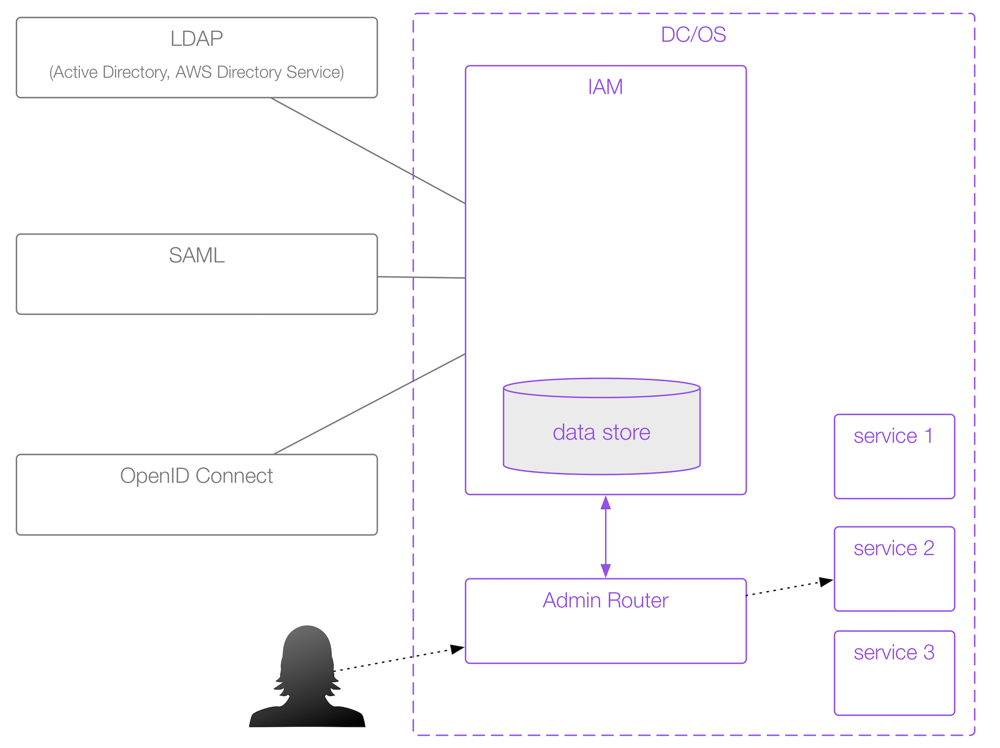

# User Identity and Access Management

Managing access to services is a basic requirement in any enterprise-grade setup. DC/OS provides you with flexible user identity management combined with fine-grained access control. The overall approach to user identity management and access control in DC/OS looks as follows:

1. When one of your users attempts to access a service the request is first routed through a system component called Admin Router.
1. The Admin Router coordinates with the Identity and Access Management (IAM) system component to verify if a certain user can access the targeted service. The IAM system component uses a highly available, replicated data store to keep track of user identities. The access verification process comprises:
  * **Authentication**: in the first step the user identity is verified; the user identity can be verified locally (DC/OS cluster-internal) or against external sources using protocols like LDAP, SAML, or OpenID Connect (OIDC).
  * **Access control**: if the user identity has been confirmed, the permissions of the respective users are checked against the resource in question (here: `service 2`).

# Authentication

Enterprise DC/OS user authentication is performed in the Admin security zone and any communication to DC/OS Admin Router from an external client is over an SSL Channel. DC/OS Admin Router presents an SSL certificate issued by the DC/OS certificate authority (CA) to external clients. Clients can then validate all requests originating from DC/OS Admin Router to have come from a valid server by validating the server’s certificate with the DC/OS certificate authority.

Below is an example of a complete end to end sequence diagram of all the steps in authenticating any user request.

![Enterprise DC/OS Authentication Sequence] (/assets/images/dcos-authN-sequence.png)

Besides [adding a user locally](/docs/1.8/administration/id-and-access-mgt/users-groups/add-local-user/) you can use either of the following two mechanisms to authenticate users via an external source: directory-based (using LDAP, for example, Active Directory) as well as identity provider-based (SAML and OIDC).

Learn more about it in the [directory-based authentication](/docs/1.8/administration/id-and-access-mgt/ldap/) as well as the [identity provider-based authentication](/docs/1.8/administration/id-and-access-mgt/sso/) sections.

# Access control 

## User management

During installation, DC/OS creates an initial user account with `superuser` privileges. The person installing DC/OS sets the name and password of this account. As a `superuser` you can manage DC/OS users, groups, permissions, and LDAP configurations either via the DC/OS web interface or the IAM API. At least one account with `superuser` privileges is required at all times.

See also the [managing users and groups](/docs/1.8/administration/id-and-access-mgt/users-groups/) section for more details on this topic.

## Service authentication

In strict security mode, each service must authenticate against the Mesos master before it can register. Learn more about service authentication in the [Service Authentication](/docs/1.8/administration/id-and-access-mgt/service-auth/) section, including the Secrets API and service-specific ACLs (such as for Apache Spark). In the default permissive mode, service authentication is optional.

## Permissions

Permissions define what actions a user, group, or service account may perform on an object. For Marathon services and service groups, you can specify create, read, update, or delete permissions. Mesos provides control over who can view tasks and their sandboxes, as well as which services can register with particular Mesos roles, run tasks as particular Linux users, and create reservations/volumes.

Learn more about permission handling in the [Permissions](/docs/1.8/administration/id-and-access-mgt/permissions/) section.

# Programmatic interaction 

Learn more about how to programmatically interact with:

* [IAM Service](/docs/1.8/administration/id-and-access-mgt/iam-api/)
* [Secret Store](/docs/1.8/administration/secrets/secrets-api/)
